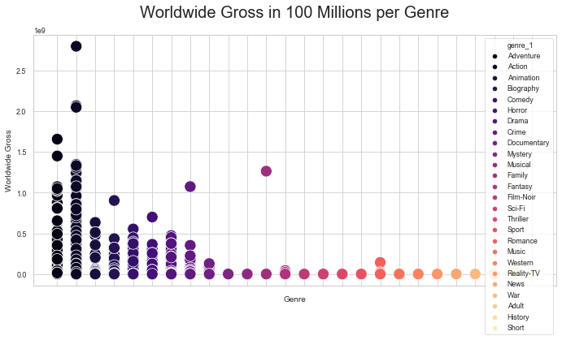

# Module 1 Final Project
Team Members: Dolci Sanders & Wayne Hong

## Introduction

For our project, we decided to explore movie industry. We gathered and analyzed over 3700+ data from [Box Office Mojo](https://boxofficemojo.com) by webscraping. We will offer recommendation to Microsoft on whether they should get into the movie industry. By collecting this data, we will be able to answer the following questions.

1. When should we release original content?
2. What genre has the highest return? (Genre/Total Gross)
3. How much should Microsoft budget? (Budget vs Total Gross)
4. What MPAA has the most Worldwide Gross? (MPAA vs Total Gross)
5. Does runtime affect total gross? (Runtime vs Total Gross)

## File Structure

- web-scraping.ipynb - Scrapes data of all movies from Box Office Mojo website in 2016-2020
- Data Cleaning and Preprocessing.ipynb - Cleans data and create new columns based off of the received data
- Data Visualizations.ipynb - Creates visuals to analyze our data to offer recommendation
- PNG Folder - Stores all png files for our visualizations
 
## Libraries
- pandas
- requests
- numpy
- matplotlib
- BeautifulSoup
- re (regular expression)
- json
- ast
- math
- seaborn

## Data Collection & Data Cleaning

We browsed through film industry related websites such as Box Office Mojo, Rotten Tomatoes, IMDB, and TMDB. We realized that we wanted to use Box Office Mojo website to scrape data off their site due to the amount of data that we could scrape off about a movie. 

### Webscraping

We first used webpages that have a list of all movies in 2016-2020 from Box Office to abstract all the URLS of single movies in each year. Then, we created functions that loop over each movie URL to get data such as title, release_date, budget cost, genre, domestic gross, worldwide gross, MPAA rating, and runtime. We had used BeautifulSoup with selectors as well as using regular expression to search through our html tags. After scraping was done, we were left with a list of dictionaries in which each dictionary was a movie. 

### Data Cleaning

After we were done scraping data, we were able to save a .csv file and start cleaning our data using pandas library. We spent most of our time to reassign the correct values as the websites that we scraped from sometimes had different html structure. We also spent alot of time going back to visit URLs that had null values. We created alot of new columns to clean and prepare our data to use for data visualization. We exported the final data csv file to be used for data visualization once we were completed. 

#### Data Visualization

We used both seaborn and matplotlib libraries to create our visualization such as line graph, bar graph, and scatterplot graph.

## Analysis

We will show our analysis using visualization. 

#### Worldwide Gross and Release Month

As we see on the charts plotted below, both domestic and world wide gross seems to be showing the same distribution, world-wide, however, does show an increase in July where Domestic does not. 
As a streaming service, by this data, we would recommend setting the launch date for December or November, respectively. Additionally the range for both June and July do overlap with some of the range in December or November. 
The last of the 3 charts for question 1 shows the average worldwide gross per 100 million per month. 

#### Genre and Total Gross

To answer our second question, we will look at Genre and Total Gross. The data indicates that Action and Adventure have the higher return. 
We have limited every movie to one genre, meaning that this graph is not entirely accurate. 
This is a complex subject because so many genres and mixes now exist. 

When looking at the data on multiple graphs, different conclusions can be drawn when not compared to each other.
The first graph is by average worldwide gross in a bar chart, the second one showing range in a bar chart, the count of movies in a bar plot, worldwide gross by genre scatter plot, and last average worldwide gross per genre in a scatter plot. 

These combined charts give us a better picture of the content. 
We know:
 1. top grossing are Action, Adventure, and Family
 2. Drama accounts for more of the count than any other 1 genre
 
Additionally, we have to note that because only 1 genre was taken from each movie, there are multiple ways to plot this, and multiple datasets that can be draw from this specifically.

#### Budget and Total Gross.

Most movies with a budget spend of 100-200 million return an estimated 500 million dollars. This is very packed data which shows that with that 100-200 million you could return as much as 1 billion dollars. 

#### MPAA Rating and Worldwide Gross

As we first thought of a hypothesis to answer this question, we initially expected G-rating movies to have the highest return on gross revenue because G-rating movies are suitable for all ages without parental guidance. However, from our observations, we realized that this was not the case. In the first chart, we have a bar graph that shows the highest return from PG-13 movies followed by PG movies. We speculate that this might be due to cinema-goers finding G-Rating movies not as interesting to spend money. Also, we were not able to see our bar graph showing anything for other ratings such as MPG and NC-17. 

We then plotted a scatter graph to try to see our data plot. We can see some plot for those ratings and we speculated this is due to movies not rated as these by the local standards organizations. 

#### Runtime and Worldwide Gross

From the chart below, we can make observations that a majority of movies runtimes are between 60 minutes to 200 minutes. However, we can also see that worldwide gross revenue increases mostly within the same timeframe. If Microsoft were to make a movie to generate a higher worldwide gross revenue, we can make hypothesis that movie should be within 60 minutes to 200 minutes. We can also speculate that viewers may not be willing to spend a lot to watch a movie for too short of a time and for too long of a time. To answer the question, we believe that runtime does have an effect to the gross revenue.  

## Conclusion

To answer our main question of whether Microsoft should release a movie, we believe that Microsoft should release a movie as Microsoft is a big corporation that has the funds to create any movie that they would possibly want. However, we want to specify that in order for Microsoft to have a good profitable return, we believe that they should make a PG-13 rated movie between an hour to 3 hours and to release the movie sometime in December. We also recommend Microsoft to spend more money to receive the bigger return as we know that there is positive correlation between the two variables. 

